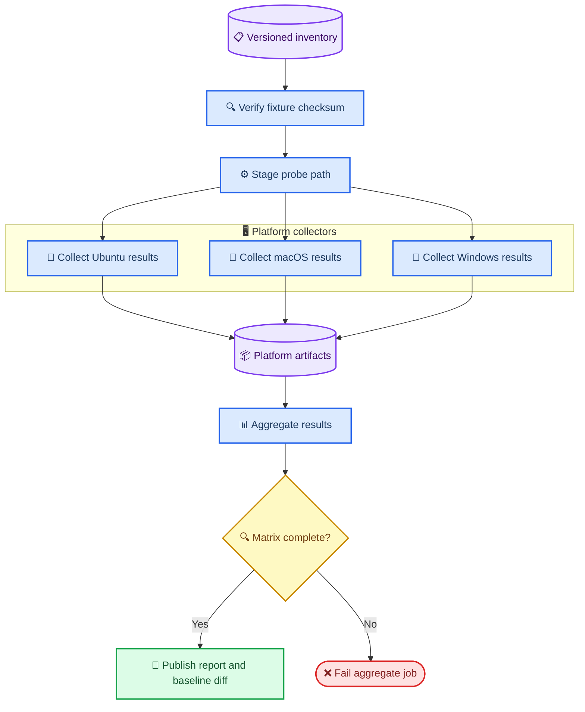

# Cross-platform backend conformance design

_Accepted design for maintainers who need evidence that `lexical`, `magic`, `magika`, and `hybrid` return correct and consistent file-type results on supported operating systems._

---

## 📋 Decision

The project will add a versioned backend inventory, a per-platform collector, and an aggregate report. The inventory defines the finite set of extension-and-content cases that this project claims to verify. Each collector runs the four existing backends in a fresh Python process on each inventory case. An aggregate step evaluates every result against Ground Truth, compares results across operating systems, and publishes tables, numeric summaries, Mermaid graphs, CSV, and JSON artifacts.

This design applies to `LexicalInferencer`, `MagicInferencer`, `MagikaInferencer`, and `HybridInferencer`. It does not add a regex backend; the existing lexical backend represents filename and suffix inference.

The design answers two separate questions:

1. Does a backend result match the declared Ground Truth for this fixture?
2. Does the same backend return the same semantic result on Ubuntu, macOS, and Windows?

A difference in any observed semantic result marks the current project output as platform-dependent for that inventory case. The report records tool versions so it does not overstate the root cause as the operating system alone.

## 🎯 Scope and success criteria

### In scope

- A source-controlled inventory for every supported extension-and-content fixture pair.
- Ground Truth evaluation for MIME types and extensions.
- Fresh-process collection for all four backends on x64 GitHub-hosted Ubuntu, macOS, and Windows runners.
- Per-run Markdown, Mermaid, CSV, and JSON evidence.
- A GitHub Actions workflow that collects platform artifacts and aggregates them in one job.
- Regression detection after maintainers accept a reviewed baseline.

### Out of scope

- The FileKind rename, package migration, and version bump.
- A new regex backend.
- Claiming coverage of extensions that lack a checksum-verified fixture and Ground Truth.
- Changing inference behavior to hide platform differences before the suite measures them.
- Replacing `libmagic` or Magika solely to make the initial report green.

### Success criteria

- Every inventory record has a fixture path, SHA-256 checksum, probe extension, Ground Truth, provenance, and four backend observations per collected platform.
- The aggregate job rejects a missing platform artifact, an invalid inventory checksum, or an incomplete observation matrix.
- The report separates Ground Truth correctness, backend availability, raw-value differences, and semantic cross-platform divergence.
- The report can answer, with counts and row-level evidence, whether any backend is platform-dependent for the measured inventory.
- Subsequent runs compare against an approved baseline and fail only on unreviewed changes, not on pre-existing known mismatches.

## ⚙️ Inventory contract

An extension alone does not identify a file format reliably. The inventory therefore uses an extension-and-content fixture pair as the unit of evidence. When one content fixture represents several suffix aliases, the collector stages that same checksum-verified content under each declared probe extension. This verifies lexical behavior without duplicating fixture bytes.

`tests/truth/backend_inventory.json` becomes the authoritative source for the new suite. Each entry follows this shape:

```json
{
  "id": "seven-z--7z",
  "fixture": "tests/fixtures/sample.7z",
  "sha256": "a4cf06a4d0a9a1571d0d3343aaa3f70680a6f6401507cd5d83d5637f08715eac",
  "probe_extension": ".7z",
  "ground_truth": {
    "mime_types": ["application/x-7z-compressed"],
    "extensions": [".7z"]
  },
  "provenance": "Generated via Python archive library (zipfile/tarfile/bz2/lzma)",
  "backends": ["lexical", "magic", "magika", "hybrid"]
}
```

A suffix counts as covered only when at least one inventory record supplies all of these fields. If the same suffix has distinct valid content formats, the inventory contains a separate record for each fixture. The report shows both record coverage and unique-suffix coverage.

The current canonical fixture data is migration input, not a competing source of truth. The current tool snapshot is historical drift data and will not decide correctness after the inventory cutover.

## 🔍 Result model and evaluation

The collector preserves the exact tuples returned by `FileType` as `raw_output`. It also creates `semantic_output` by lowercasing, de-duplicating, and sorting MIME types and extensions. This prevents tuple ordering from being counted as a behavioral difference while retaining row-level raw evidence.

Each observation includes:

| Field | Purpose |
| --- | --- |
| `inventory_id` | Links the observation to the fixture and Ground Truth |
| `backend` | `lexical`, `magic`, `magika`, or `hybrid` |
| `platform` | Runner OS, architecture, and image label |
| `runtime` | Python, package, libmagic, Magika package, and model versions |
| `raw_output` | Returned MIME and extension tuples without normalization |
| `semantic_output` | Normalized MIME and extension sets used for comparison |
| `status` | `ok`, `no_result`, or `error` |
| `error` | Exception type and message when `status` is `error` |
| `evaluation` | MIME match, extension match, and overall match booleans |

`mime_match` is true when the normalized detected MIME set intersects the Ground Truth MIME set. `extension_match` is true when the normalized detected extension set intersects the Ground Truth extension set. `overall_match` requires both values to be true. `no_result` and `error` are never overall matches.

Cross-platform comparison uses `semantic_output`. The report also counts raw-only differences separately. A backend is deterministic for a record only when all collected platforms have the same semantic output and availability status. The report labels any failure of that condition as a cross-platform result divergence; it does not claim an OS-only cause when Python, libmagic, or Magika versions differ.

## 📊 Collection and reporting flow

The collector must run outside the normal pytest process because the current truth tests initialize `mimetypes` with built-in mappings. A fresh subprocess exposes the production process state and makes host mapping differences measurable rather than masked.



The aggregate step produces these outputs for every complete run:

| Output | Contents | Audience |
| --- | --- | --- |
| `backend-conformance.json` | Every observation and evaluation | Tooling and detailed review |
| `backend-conformance.csv` | One flattened row per observation | Spreadsheet analysis |
| `backend-conformance.md` | Tables, counts, divergence rows, and Mermaid graphs | Maintainers and pull-request review |
| GitHub Actions job summary | Headline counts and report artifact links | CI readers |

The Markdown report contains four fixed sections:

1. **Execution matrix**: runner, Python, libmagic, Magika, and model versions.
2. **Ground Truth correctness**: evaluated, correct, incorrect, no-result, and error counts and rates for every OS × backend pair.
3. **Cross-platform divergence**: Ubuntu/macOS, Ubuntu/Windows, and macOS/Windows difference counts and rates by backend, split into raw-only and semantic differences.
4. **Evidence rows**: every semantic divergence, Ground Truth mismatch, no-result, and error with expected and observed values.

The generated report includes a `xychart-beta` Mermaid graph for Ground Truth mismatches by backend and OS, and a second graph for semantic divergences by backend. Each graph uses only values calculated by the aggregate job; the design document does not pre-populate synthetic measurements.

## 🔧 Test boundaries

The suite separates pure validation from platform execution.

| Component | Responsibility | Tests |
| --- | --- | --- |
| Inventory loader | Parse schema, enforce uniqueness, verify checksums | Unit tests with invalid and duplicate entries |
| Probe stager | Materialize a path with the declared suffix | Unit tests for aliases and cleanup |
| Backend collector | Execute one backend in a new process and serialize observation | Integration tests with a small fixture subset |
| Evaluator | Apply Ground Truth and divergence rules | Unit tests for matches, mismatches, no-result, errors, and ordering-only differences |
| Aggregator | Require a complete matrix and render report data | Unit tests with fixture observation files |
| Workflow | Provision dependencies and pass artifacts between jobs | GitHub Actions run on each supported OS |

A collector catches backend exceptions and records them as an observation. It must not silently fall back to another backend, skip a missing native dependency, or turn an unavailable backend into a passing case. The aggregate job fails when any expected observation is absent.

## 📦 GitHub Actions design

A dedicated `.github/workflows/backend-conformance.yml` keeps the costly operating-system matrix separate from the existing fast CI workflow.

- **Triggers:** `pull_request` for detector, truth, dependency, or workflow changes; `workflow_dispatch` for investigation; and a weekly schedule for runner and dependency drift.
- **Collector matrix:** one x64 GitHub-hosted runner for Ubuntu, macOS, and Windows, each with one pinned reference Python version. A preflight check records and verifies `x86_64`; an architecture mismatch fails collection instead of being reported as an operating-system difference. A single Python version isolates operating-system comparison; Python-version coverage remains the existing CI workflow's job.
- **Native dependencies:** every collector installs and records its `libmagic` distribution. Windows must use an explicitly selected, version-recorded distribution. If that distribution cannot load, the collector reports the magic backend unavailable and the aggregate job fails coverage instead of skipping it.
- **Artifacts:** each collector uploads exactly one structured observation file named by platform. The aggregate job downloads all expected artifacts and validates their platform identity before evaluating them.
- **Initial rollout:** the first complete run is report-only. Maintainers review Ground Truth mismatches and platform divergences, then commit an approved baseline.
- **Steady state:** later runs compare with the approved baseline. New, removed, or changed observations fail the conformance gate until a maintainer intentionally updates the baseline.

## 📚 Alternatives considered

### Snapshot-only collection

This option stores one output snapshot per operating system.

- **Benefits:** smallest implementation; captures drift quickly.
- **Costs:** treats a platform result as a proxy for correctness; cannot distinguish no-result, Ground Truth mismatch, and OS divergence.
- **Decision:** rejected because the user needs correctness and platform dependence as separate conclusions.

### Extend the existing CI matrix

This option adds macOS and Windows directly to the current general test workflow.

- **Benefits:** fewer workflow files; familiar pytest path.
- **Costs:** matrix jobs cannot produce one coherent evidence report without an aggregation phase; expensive platform collection obscures fast feedback; runtime differences become ordinary test logs.
- **Decision:** rejected because it does not preserve the requested tables, graphs, and numeric evidence.

### Inventory, collectors, and aggregate report

This option treats Ground Truth and platform execution as separate, versioned contracts.

- **Benefits:** explicit coverage boundary; reproducible evidence; direct comparison across all backend and OS combinations; later regression gate.
- **Costs:** new data model, native dependency setup, and a dedicated workflow.
- **Decision:** accepted because it supplies the requested correctness and determinism conclusions without hiding uncertainty.

## ⚠️ Consequences and risks

The initial report may show that current production output is platform-dependent. That is a result to preserve, not a test failure to mask. The suite makes a later remediation decision—such as deterministic MIME registry initialization or a pinned native magic database—measurable.

Native `libmagic` packaging is the highest implementation risk, especially on Windows. The implementation must select a supported distribution, pin its version, record it in every observation, and treat load failure as a visible coverage failure. A backend's absence must never be presented as correctness.

The inventory creates a maintained support boundary. Adding a suffix requires a valid fixture, checksum, Ground Truth, and provenance. This adds contribution work, but it prevents an unsupported suffix from being counted as verified.

## ✍️ Implementation sequence

1. Define and validate the inventory schema, then migrate the existing canonical fixture corpus into explicit extension-and-content records.
2. Build the fresh-process collector and evaluator with unit tests before adding the full matrix.
3. Add the aggregate renderer and verify its report with fixture observation files.
4. Add the dedicated GitHub Actions workflow, provision native dependencies, and collect the first complete three-platform report.
5. Review the first report, establish the approved baseline, and enable the regression gate.

## 🔗 Related project material

- [Inference strategy explanation](../../explanation/inference-strategies.md)
- [Current accuracy benchmarks](../../reference/accuracy-benchmarks.md)
- [Current architecture](../../architecture.md)
